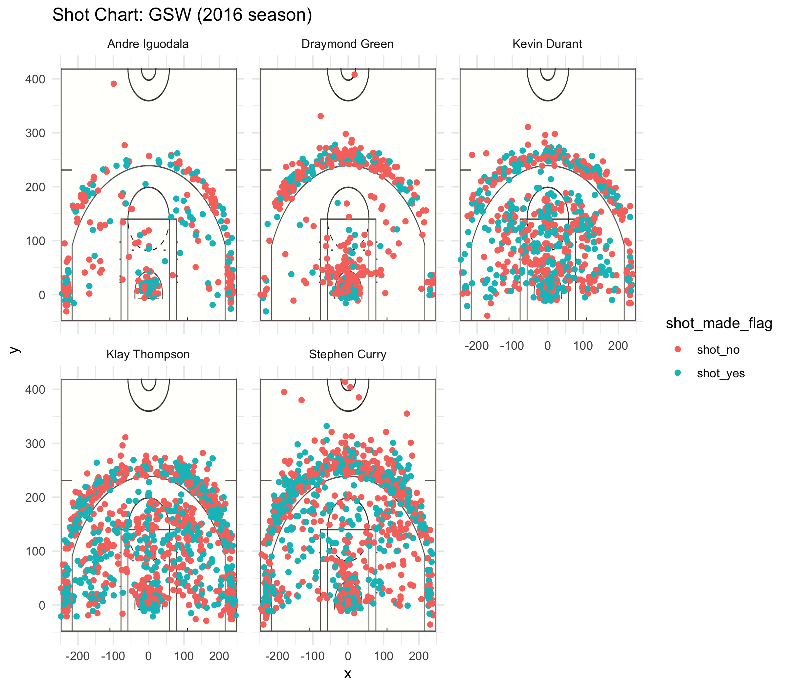

```{r echo=FALSE, results='hide', message=FALSE}
library(dplyr)
library(knitr)
#making data tables
#total shots
total_table <- read.csv("../data/shots-data-summary.csv")
```

```{r out.width= "70%", echo = FALSE, fig.align='center'}

```


###Intro
  For the Golden State Warriors, 2016 was an amazing year. Referred to by many as a "superteam", they broke the playoff NBA record with 16 wins and 1 loss. That year, the Warriors won the NBA Championship Finals for the fifth time - defeating the mighty Cleveland Cavaliers by a margin of 4 games to 1. This series of finals was historic for another reason, however, as this was the third year in a row that the two teams had faced off for the same trophy. 2016 was a historic year for Steve Kerr and his Golden State Warriors for a multitude of other reasons as well. The achievements of this incredible team include winning both the Pacific Division and Western Conference Championships three seasons in a row, as well as multiple records being broken by Stephen Curry, and awards won by Draymond Green, and Kevin Durant. The incredible success of this unique team can be credited to many factors, including the coaching and mentality of the players. However, one aspect that was irrefutably crucial to the Golden State Warriors sweeping the league was the individual prowess of each of the players – in particular, Andre Iguodala, Draymond Green, Kevin Durant, Klay Thompson, and Stephen Curry. These players excelled across the board in all components of the game, such as ballhandling and defense, but it was their offensive plays  and shooting percentages that really made them stand out from the other teams, and propelled them to the top of the charts. This report will analyze the shooting data of each of the five key players, and provide graphics that display the distribution of shot locations on the court. We will tally up the total number of shots taken by each player, look at the number of two or three pointers taken by each player, and calculate what proportion of taken shots were made, or not made. Moreover, by looking at the shot location charts, we can potentially pinpoint which areas on the court each player prefers, and if there is a skew to which type of shot each player prefers (two pointers or three pointers).
In doing this, we hope to better understand how the Golden State Warriors were able to excel during their historic 2016 season.

###Data
  The data analyzed came from the data folder from the Stat 133 Homework Github repository. The original data came as CSV files, which stands for Comma Separated Values. Each player had his own CSV file, which included raw data for the game date, season, period, what type of shot it was, the opposing team being played, and the coordinates on the court where the shot was taken. Any extra clarifications or descriptions for column titles can be found in the data dictionary titled `data-dictionary.md` and is found in the `data/` folder of the project files. The data was modified slightly – a column `name`  was added with the name of the player, a column `minute` was added to specify the minute in which the shot was taken, and the options for `shot_made_flag` were altered to either `shot_yes` or `shot_no` to better describe whether or not the shot was made. Ultimately, the five CSV files were combined into one large CSV file with data from each player, titled `total_table`. It is with this data table that all the following analysis was done.

###Analysis

####Total Shots
```{r echo=FALSE, results='hide'}
#Total shot table
total_summary <- arrange(summarise(
  group_by(total_table, name),
  total_shots = sum(shot_type == "2PT Field Goal" | shot_type == "3PT Field Goal"),
  made_shots = sum(shot_made_flag == "shot_yes"),
  percent_made = made_shots/total_shots
),desc(percent_made))
total_summary
```
| Name              | Total Shots Taken | Number of Shots Made | Proportion of Shots Made |
|:-------------------:|:-------------------:|:----------------------:|:--------------------------:|
| Kevin Durant | 914 | 495 | 0.54 |
| Andre Iguodala | 371 | 192 | 0.51 |
| Klay Thompson | 1220 | 575 | 0.47 |
| Stephen Curry | 1250 | 584 | 0.47 |
| Draymond Green | 578 | 245 | 0.42 |

> Table 1: Total shot statistics for five players on the Golden State Warriors - ordered by decreasing proportion of shots made.

  On average, the shot statistics of these five players are abnormally high, which without a doubt played a central role in the Golden State Warrior’s climb to victory and fame. Specific data is shown in Table 1 above. One significant thing to note is the total number of shots taken, regardless of whether or not they were made. Steph Curry and Klay Thompson had a staggering total of 1250 and 1220 shots taken, with Kevin Durant a little bit behind with 915 shots. Among all five of the “superteam”, a grand total of 4,334 shots were taken, which is an incredibly high number. It is often stated that an exceptional shooting percentage is above 45%, with some variability depending on the position. Many teams only have a few players that are even close to this level. However, four out of the five players on the Golden State Warriors that we are analyzing have shooting percentages over 45 percent, and Durant and Iguodala have shooting percentages of over 50 percent. Kevin Durant had the highest shot percentage, with a whopping 54 percent of shots made, while Draymond Green had the lowest, with 42 percent. That being said, note that Green was mainly known for his defensive plays, and was the recipient of the Defensive Player of the Year Award. Having a team stacked with such high-scoring players was key to the team’s success and is what sets the Warriors apart. Note that this data is based off of total shots taken, including both two pointers and three pointers. Let’s dive deeper into the data and look at two point and three point data separately.

####Two-Point Shots
```{r echo=FALSE, results='hide'}
#Two point table
two_point_table <- filter(total_table, shot_type == "2PT Field Goal")
two_point_summary <- arrange(summarise(
  group_by(two_point_table, name),
  total_two_point_shots = sum(shot_type == "2PT Field Goal"),
  made_shots = sum(shot_made_flag == "shot_yes"),
  percent_made = made_shots/total_two_point_shots
),desc(percent_made))
two_point_summary
```

| Name  | Total Two-Point Shots Taken | Number of Two-Point Shots Made | Proportion of Two-Point Shots Made |
|:-------------------:|:-------------------:|:----------------------:|:--------------------------:|
| Andre Iguodala | 210 | 134 | 0.64 |
| Kevin Durant | 643 | 390 | 0.60 |
| Stephen Curry | 563 | 304 | 0.54 |
| Klay Thompson | 640 | 329 | 0.51 |
| Draymond Green | 346 | 171 | 0.49 |

> Table 2: Two-point shot statistics for five players on the Golden State Warriors - ordered by decreasing proportion of two-point shots made.

  When we look at two-point shots by themselves in Table 2, we see a slightly different trend. Here, the shot leaders are Kevin Durant and Klay Thompson, with 643 and 640 shots taken, respectively. At a close third is Stephen Curry with 563, followed by Draymond Green with 346, and lastly, Iguodala with 210. Even though Iguodala had the lowest number of shots taken, his percentage was the highest with 63% shots made. In fact, all five players in question have shooting percentages of over 45% - quite an impressive feat. The player with the lowest shot percentage is again, Draymond Green, with 49%, which by no means is bad. One interesting thing to note is that with the exception of Stephen Curry and Klay Thompson, the remaining players mostly take two-point shots – that is, two pointers make up the vast majority of their total shots. Thompson takes roughly 50% two pointers and 50% three pointers, while Curry takes a majority of his shots as three pointers.

####Three-point shots
```{r echo=FALSE, results='hide'}
#three pointers
three_point_table <- filter(total_table, shot_type == "3PT Field Goal")
three_point_summary <- arrange(summarise(
  group_by(three_point_table, name),
  total_three_point_shots = sum(shot_type == "3PT Field Goal"),
  made_shots = sum(shot_made_flag == "shot_yes"),
  percent_made = made_shots/total_three_point_shots
),desc(percent_made))
three_point_summary
```

| Name    | Total Three-Points Shots Taken | Number of Three-Points Shots Made | Proportion of Three-Point Shots Made |
|:-------------------:|:-------------------:|:----------------------:|:--------------------------:|
| Klay Thompson | 580 | 246 | 0.42 |
| Stephen Curry | 687 | 280 | 0.41 |
| Kevin Durant | 272 | 105 | 0.39 |
| Andre Iguodala | 161 | 58 | 0.36 |
| Draymond Green | 232 | 74 | 0.32 |

> Table 3: Three-point shot statistics for five players on the Golden State Warriors - ordered by decreasing proportion of three-point shots made.

  When it comes to three pointers, as displayed in Table 3, Thompson and Curry top the charts with 580 and 687 shots taken, respectively. These two also have the highest shooting percentages, with 42% and 40%, respectively. Again, Green is at the bottom of the chart with only 31% of his three pointers being made. It is unsurprising that the shooting percentages are much lower for three pointers – players are much further away from the hoop. Note how many three point shots were taken by Curry and Thompson. Both of them have more three point shots than either Green or Iguodola have total shots. 

####Shot Chart
```{r out.width= "80%", echo = FALSE, fig.align='center'}

```

> Figure 1: Shot charts for five players on the Golden State Warriors. Orange = shot missed, blue = shot made.

  The drastic variation within number of shots taken can be visualized by shot charts for each player, as demonstrated in Figure 1. In the chart, a dot represents a shot taken. It is orange if the shot was missed, and blue if the shot was made. It is clear to see that Thompson and Curry have taken the most shots, as shown by the vast multitude of dots that pepper their chart, while Iguodala and Green have much emptier courts. It’s interesting to note that all players have a region of concentrated dots right where the hoop would be – likely these represent alley oops, dunks, or layups. Curry and Thompson’s charts are different than the others because of the noticeable concentration of shots taken outside the three point line. Additionally, just by looking at the color distributions of the different charts, we can see that Green appears to be the least successful with his shots – the majority of his dots are orange, signifying missed shots. On the other hand, we can clearly see that Thompson has greater relative success, as his chart contains many more blue dots.

###Conclusion

  All in all, the Golden State Warriors have a fantastic team with players with not only high numbers of shots taken, but also high shot success percentages. Many teams have one or two star players that are capable at playing at a high level. However, the GSW have five of these exceptional players, resulting in an incredibly stacked team. It is very likely that the efforts of these five players played a central role in the success of the Warriors during the 2016 season. Though this report only focuses on shots, there are a multitude of other factors such as defense, ballhandling, motivation, mentality, and attitude that these players brought to the table that also propelled the Warriors to victory. The Golden State Warriors truly are a superteam - and it will be interesting to see how their roster changes in the upcoming years.
  
  
```{r out.width= "70%", echo = FALSE, fig.align='center'}

```


```{r echo = FALSE, comment = NA, results='hide'}
#Raw data that was used to construct the tables is provided below.

#Total points shot
total_summary

#Two pointers
two_point_summary

#Three pointers
three_point_summary
```